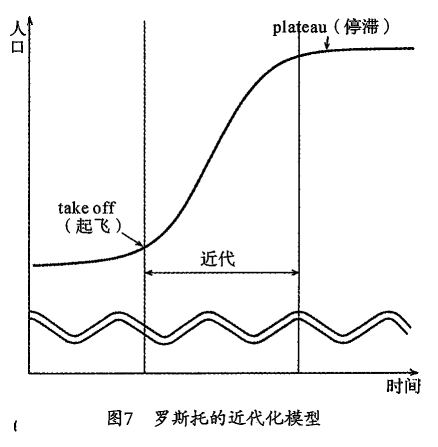

## 第十一章家庭的革新 Ⅰ

### 人口资源

人口被看作是一种资源，这种观念源于近代以后。马尔萨斯（Malthus）的《人口论》著于 1798 年。而这也标志着作为“学科”的“人口学”诞生了。在这样的背景下，出现了三种观点：

第一，“人口在不断增加”的现状认识；
第二，“使人口增加”的发展理论；
第三，“人口可以调节”的统一管理理论。

近年来，社会史研究均从人口统计学（demography）理论出发，这的确存在着一定的依据。罗斯托（Rostow）主张最为单纯的近代化。从他的观点上来看，近代化的“takeoff'（起飞）是人口激增期，而近代化的完成期则是“plateau"（停滞）——人口增长停滞期时期（图 7）[Rostow，1960]。因此，我们从人口变化曲线就可以知道近代化的开始与结束。而所谓“近代”就是指夹在近代以前和近代之后这两个停滞期之间的、人口不断增加的过渡时期 [*] 。

> [*] 罗斯托之后的近代化论也几乎都是基于人口学模式的。比如理斯曼（Riesman）在论人类社会学的经典著作《孤独的人群》[Riesman，1950] 中提出了将近代化社会意识分为"传统导向型”"内在导向型”“他人导向型”。这也基本上是以人口统计学为基准来划分近代化各个发展阶段的。

人口增长时期是一直处于变动的时期。社会人口承载量变化会导致人口的增加，而人口的增加也会使得社会随之发生变化。人口在数量上的变化一定伴随着社会的质变。我们所说的“近代”是人口增长时期，其实这也意味着“近代”是社会变动的过渡时期。所以人口增长一旦进入了停滞期，这就表明社会变动的过渡期随之结束了。

_图 7 罗斯托的近代化模型_

当然，即便是在人口停滞的传统社会中，人口也被看作是一种资源。但是，从以下两点来看，这仍然与“近代”社会存在着差异：（1）人口并不会如愿以偿地增长；（2）存在一些社会性牵制力使得人口停止增长。一般而言，“前近代”社会存在着婴幼儿的高出生率和高死亡率的多生多死现象。仅仅从这点来看，我们并不能把这种现象称为人口调节。如果弃之不管，任由人类被欲望驱使进行不断的性交，并且在完全不懂得受孕调节的情况下怀孕，在人类可以生育的年龄阶段一直不停地生育孩子，这样，多数孩子还会因为环境的不卫生或是疾病等原因夭折死亡。或许有人会说，人类居然是这样野蛮的生物啊！而我认为，“人口论”才是真正野蛮的近代主义式主观论断。

对于那些研究“未开化社会”的人类学家而言，这确实是理所当然的事（但从别的观点来看，这着实令人吃惊）。但在生产力水平极低的狩猎采集社会之中，人口的净再生产率控制在 1.0 左右。然而，这并不是多生多死导致的，而是源于受孕率本来就不高。当人们还不知道怀孕是怎样一种现象的时候 [*] ， 很难说人们有避孕的意识以及相关的技术。但无论如何这是人类学家也不尽了解的情况，也就是为什么那时的人们一生并不会生育七八个孩子。

> [*] 比如，马林诺夫斯基（Malinowski）认为，基里维纳群岛岛民对如果没有男女性交，就无法生育孩子的观点付之一笑。而澳大利亚的原住民则认为，被祖先的图腾附身就会怀孕。他们都没有将性交与怀孕联系在一起。

社会史学家落合惠美子认为，人口调节有以下两种手段：控制结婚和控制婚内的生育 [落合，1987]。在传统社会中，由于很难筹措聘礼，所以不是谁都可以结婚；月子期间的性交禁忌以及漫长的哺乳期，使得生育的间隔时期较长；而性交频率不如“近代人”高也是原因之一。性交频率不如“近代人”多一恐怕没有像“近代人”一样，因量化后的性交（次数以及持续时间！）而产生出强迫性神经质执念的人吧！并且，以前人们的性交大概指的是体外射精（确认这件事比较困难，所以这也只是揣测而已）。由于以上种种原因，并没有导致这种结果——任由人们生孩子，孩子就会不断增加。

另外，这种停滞的社会与周围的生态系统之间也保持了某种协调性的动态平衡。狩猎采集的原始人并不是挣扎在饥饿线上的人，也不是只要是能入口之物就毫无节制地从大自然的恩惠中一•味索取的人。各种各样的食物禁忌以及礼节性禁忌构筑起了一种文化规范，这种规范处于生态系统之中，以避免耗尽环境资源。他们没有办法百分之百地有效利用可以食用的环境资源。萨林斯（Sahlins）将这种社会称为"富饶社会"（afflunet society）[Sahlins，1974] [*] 。

> [*] 如果人类的净生产率停滯在 1.0 左右，那么可能突发的气候变化等原因会给全体人类带来毁灭性的打击。正如饥荒时濒临灭绝危机的部族，事例比比皆是。但是，一般而言，由于他们不会榨取生态系统到人口承载量的极限，所以饥荒的时候也勉强幸存下来。实际上，在非洲部落社会，从狩猎采集向农耕方式转移的人群之中，饥荒时农耕人群比狩猎采集人群的死亡率要高。他们中的一部分抛弃了农田而又重新开始了狩猎采集的生活。因为狩猎采集的幸存可能性更高。

而“停滞社会”就是不会把生产和再生产推向最大化（maximize）的社会，也是不会超越其能力极限的社会。如此一来，无论是在生产力水平还是再生产力水平上，“停滞社会”都只是单纯重复着再生产而已。

因此，在性与社会结构之间，存在着某种说不清、道不明的自我调节机制。正如罗斯托所言，倘若“近代化”的起飞是源于突然间的人口爆发，那么这种人口增长则是文化一社会的调节机制由于某种原因失效所产生的结果。这不仅仅只是由于卫生水平的提高使得婴幼儿的死亡率降低（当然这也是原因之一）。而且，从人类史上来看，女人一生之中生育将近 10 个孩子，这种现象本身就是极为反常的。

所以，所谓的“近代”，就是指“失效的社会”，也就是在人与自然、人与身体之间，文化一社会的调节机制开始失效的社会。禁忌的解除使得人类朝着生产和再生产最大化的方向发展前进。当然，禁忌的解除还有一个别名，叫作“解放”。扩大再生产的循环一旦开始，无论人类曾经历过怎样的传统，人类转瞬间就会忘记。

在亚洲和非洲，那些孩子较多的家庭的出现并不是“前近代”才有的现象（早在明治时期，日本的出生率就很高了）。它也属于“近代”的现象，它是在各个发达国家控制下的落后（under-developed）状态，是同时期“近代”世界体的一部分。我们所看到的非洲饥荒，正是失效的社会，或是社会的被迫失效所导致的一种悲剧。

### 控制出生和"再生产的自由”

因此，人口政策从近代民族国家（nation state）形成之初便成为了重要的政治课题。市场与个体资本虽然对劳动力的再生产表现出了不干涉、不关心的态度，但国家却并非如此。近代国家一直对人口政策极为关心，诸如国家时而禁止堕胎时而又将其合法化，时而惩罚计划生育时而又鼓励计划生育。不仅如此，美国、_部分保守州的法律仍然延续着维多利亚时期的性道德，就在近几年，法律甚至介入市民的床笫之事，比如禁止同性恋、批判婚外性交，连夫妻间的口交都被视作是违法行为。

家庭是统一管理性和生育的社会领域。在文化人类学中，虽然"家庭”的概念早已解体，几乎无法定义，但即便如此，社会中。由性别和年龄划分而定义的社会领域仍然根深蒂固。\_直以来，家庭或亲族都是统一管理生产和再生产的社会单位。而说到“近代”，它所特有的现象便是，生产从家庭这个领域“脱离”（disembed）出来，也就是其英文字面的意思——离开 bed（床）。在这个过程中，只有再生产被特殊化对待，也就是说，最后就只剩下了 bed。

因而，家庭存在着历史性以及文化一社会性的多种形式。所以历史的变动期也就是家庭的变动期。虽然在“近代”形成之时，对于家庭解体已经怨声载道，但之后当我们回顾那段历史时，它向我们证明了那只不过是“前近代”家庭的解体，“近代”家庭则取而代之登上了历史舞台。家庭史以及社会史认为，“近代”家庭的性质不言而喻，它是各种特质所组成的复合体，比如儿童的世纪［Aries，1960］、母爱的神话［Badinter，1980］、主妇的诞生［Oakley，1974］等各种现象都集中在它形成的过程中。在“近代”形成期中，与市场形成期几乎同时形成的“家庭性”（domesticity）领域又是如何同样成为不可或缺的补充物的呢？关于这点我之前已有详细地论述，这里不再赘述。

但是，在 20 世纪 80 年代，“家庭的解体”问题又再次引起了关注。如果从民主主义的“近代”这一定义出发，对于人口停滞增长且逐渐减少的英国和法国而言，它们的“近代”早已结束了。人口停滞的原因有以下几点：（1）晚婚化；（2）结婚率的降低；（3）离婚率的上升；（4）出生率的下降。这也就是说，结婚的控制和婚内生育的控制这两个因素同时发挥着作用。更简单地说，男女双方都选择不结婚或者不受制于婚姻，并且人们越来越不想要孩子了。这种结果导致了以夫妻和孩子为单位的“近代”家庭逐渐沦为了少数群体。

为家庭解体哀叹的人将这种现象称为“解体”。20 世纪 80 年代初期的美国，由夫妻和孩子组成的，并且仅依靠丈夫一人单方收入的典型“近代”家庭的比率跌落到了总体的 14%。如今，我们只能称这种“近代”家庭是极其“传统的”家庭，这种家庭甚至已经成为少数。相反，独身家庭（singlehousehold）， 以及单亲家庭（singleparentfamily， 以单亲母子家庭即 singlemotherfemily 为主）则不断增加。

既不结婚也不生孩子，这种生育的控制在所谓的自由主义发达国家之中并不是由文化禁忌或是国家统一管理而导致的，而是由当事人依照个人的自由意志所做出的“选择”。众所周知，中国、印度就并非如此。当我们看到出于自由“选择”的人们拒绝了结婚、控制了生育时，我们反而弄清了一直以来是怎样的文化一社会性强制力作用于结婚以及生育之上的。我们可以从男性与女性的身上同时看到拒绝结婚和生育的这种倾向。受过教育的职场女性以及不愿将“男女平等”的规范内在化从而接受性别角色分工的女性，这种情况在她们身上尤为明显。所以人们一直认为女性和女权主义应该对家庭解体负一定的责任。但实际上，仔细体会有关支撑“近代”家庭的意识形态话语，我们即可发现，这些话语的目标对象就是女性。结婚、生育的强制力几乎就是胁迫女性的话语。比如“婚姻才是女人幸福的终点”“女人只有生了孩子才是真正的女人”等言论比比皆是。这恐怕并不稀奇。也就是说，将男性划为生产者，将女性划为再生产者，在这种特定近代型性别角色分工之中，作为再生产制度社会单位的家庭一宜对女性在家庭中的作用寄予厚望。所谓男性的作用不过是不参与和不干涉"女性的领域”罢了。

所以，这也难怪 20 世纪 60 年代以后的妇女运动和第 Ⅱ 期女权主义对再生产强加在女性身上的文化一社会性强制力进行了控诉，为逃离这种强制力而争取自由的女性运动不断出现。而在这些运动之中，争取“堕胎权利”（abortion right）的斗争成为了运动的焦点。他们控诉法律上禁止堕胎的国家，而这是一场发生在国家与女性之间的运动，是女性为了争取法律权利的斗争。有人说，“近代”国家对国民的“私”生活（核心是被私事化的性与生育）毫不关心，然而这种说法只不过是极为荒唐的“神话”而已。“近代”国家一直以来都对管理女人的子宫这一再生产资源表现出了强烈的兴趣。正因如此，争取"再生产自由”（reproductive freedom），”将子宫交还给女性”的这种斗争正是女性解放斗争的关键，并且这种要求也同样是让父权体制最为恼火的地方 [*] 。

> [*] 主张“堕胎权利”的女权主义者遭到了批判，特别是来自右翼以及宗教界强烈的批判和暴力。直至今日，在部分国家中，堕胎以及主张堕胎都是需要豁出性命的斗争。有关"生与不生的自由”对于女性解放的意义请参照［上野，1986b］。

### 家庭解体——危机论

相比欧洲各国，日本家庭解体的问题并没有那么严峻。日本人的结婚率仍然很高，倾向于婚姻的国民性仍旧没有改变。在 40 岁之前的人当中，有 95%以上的人都有过一次结婚的经历。西欧国家则有 10%到 20%的国民选择终生不婚，与此相比，日本这样的社会实属特例。虽说日本离婚率也有上升的趋势，但是仍没有达到美国以及北欧的水平。然而最终，每个家庭平均出生婴儿的数量还是不足两人。1989 年的数据为 1.57 人，“已经停止生育孩子的夫妻……平均生育孩子数量为 2.2 人，“很少有一个孩子都不生，或是只生一个孩子的夫妻”［总理府，1985：119］。日本在 1983 年的出生率为 12.7， 这虽然接近于英国（1979 年）的 13.1、法国（1979 年）的 14.1， 但是由于日本老龄化比西欧各国出现得晚，因此虽说人口增长较少，但仍然呈现出了一定的增长趋势［矢野，1981］。据 1980 年的国势调查可知，单身户所占比率为 19.9%， 虽然这个数字已经接近了欧美的 20%， 但这并非不婚单身的数字，而是未婚单身以及老年人单身户口的数字，而且后者的增加才是主要原因。

从以上的原因中即可看出，正在席卷欧美各国的“近代”家庭单位的结构性解体，至少从表面上来看仍有挽回余地。仅从外部来看，正如集体主义式的日本型经营管理一样，日本社会即便是在家庭制度的维系上，也是完成度好到让人难以置信的 well-organized（组织良好的）社会。

如果是这样的话，那么在 20 世纪 80 年代的日本，那些担忧家庭解体的声音仅仅只是危机的预警吗？“看看美国？”“德国呢？”这些说法仿佛把某些危机的实例作为某种“不良示范”，并力图避免这种现象的发生。然而这难道仅仅是某种威胁论吗？

早在 20 世纪 60 年代之初，日本就出现了感叹“家庭解体”的声音。实际上这种声音的基调一直都没有改变。日本社会的家庭危机，从字面上理解就是家庭单位的解体以及还原成个体单位。与其说它在根本上呈现出了激烈的变化，不如说家庭单位虽然仍旧维系着家庭单位这种形态，但它已出现了某种功能性障碍，以至于无法正常运行。当然，在这种危机话语中，包含着诸如《家庭内离婚》［林，1985］、《妻子们的思秋期》［斋藤，1984］等著作的声音。这些书几乎都在批评社会，并都指出了那些表面上过着正经家庭生活的人们实际所陷入的严峻问题。即便存在“家庭内离婚”， 日本夫妻也并没有想要解除婚姻关系，并且即便存在家庭主妇症候群，大多数的女性也并不想从家庭主妇的位置上退位。大多数日本男性和女性都心知肚明，家庭单位的解体成本比维持成本要高得多。当然他们知道自己虽然面临“家庭内离婚”以及“家庭主妇症候群”（倘若并非如此，那么这些书怎会引起如此广泛的共鸣呢？）， 除去那些不幸且成为某种问题案例的少数，大多数的男女其实并没有陷入精神性的疾病之中，他们还是设法挺过了这种状况。如此一来，实地记者所描绘的问题案例仅仅是没能应对这种情况的愚蠢人群的悲剧而已。

“近代”家庭由夫妻和孩子组成，在家庭中存在着“性别角色分工”，这被视为理所当然之事，而将这种自明之理视为问题的也只有女权主义思想。与女权主义不同，那些叫嚷着”家庭危机”的声音是从另一个方向传来的，甚至可以说是从批判女权主义的方向席卷而来的。这与我们所预想的一样，“近代”家庭无法正常运行，具体来说，就是女人逐渐开始不想承担再生产劳动，而另一方面，社会对于女性开始不想承担再生产劳动的现象则出现了批评和指责的声音。她们主要的反击之处有两个方面：第由于这种家庭单位变成了核心家庭单位，所以导致无法继续承担赡养老人的责任；第二，在这种核心家庭单位中，职责地位无可取代的母亲开始工作，这导致了育儿质量的下降。

简而言之就是“核心家庭中外出工作的母亲”变成了众矢之的。家庭再生产功能的低下则被看作是女性的责任。当然，在家庭再生产职责方面，由于女性一人就是百分百的责任人，所以自然不会让男性为职责怠慢而负责。

有关“家庭危机”的言论可以追溯到 20 世纪 60 年代，这点的确耐人寻味。正如前一章中所论述的一样，因为 60 年代是城市核心家庭普及的时期，同时也是家庭主妇开始向劳动者转变的时期。所以，当“核心家庭中母亲的外出工作”逐渐开始增多的时候，她们就成为了众矢之的。

改变这种“家庭危机”的良药有两剂：第一是将“核心家庭”视为错误并试图回归大家族的期望；第二是将“家庭主妇外出工作”视为错误并高喊“女人，回归家庭”。实际上，日本的“家庭解体论”继承并延续了 20 世纪 60 年代出现的对核心家庭的批判。而所谓“危机论”，其实这种危机还尚未达到让核心家庭支离破碎并解体到个体的程度。

核心家庭本身并没有错。早先便开始了家庭核心化的欧美各国，它们的事例自不必说，引起日本核心家庭发生职责障碍的并不是家庭核心化本身，而是由于尚未成熟的社会环境并不符合家庭核心化的要求。来自家庭内外的经济要求瞬间使得对女性外出工作的批判烟消云散。时至今日，在怀抱学龄前儿童的女性之中，选择外出工作的女性人数仍在增加。如果无法批判“职场女性”， 那么问题自然就向着“核心家庭是万恶之源论”的方向发展了。

当下，有的人认为，要改变“核心家庭中外出工作的母亲”，其终极解决方法就是回归传统三世同堂的生活方式，而抱有这样想法的人仍在增加。只要三世同堂，那么处于育儿期的女性就可无后顾之忧地继续工作。不仅如此，女性外出工作还能够避免因*家同时有两位家庭主妇而产生矛盾。另*方面，往后养老的看护也不用担心。三世同堂被认定是治疗“家庭危机”的特效药。但无论是哪一种看法，这些“解决方法”中仍然存在着两种再生产劳动——育儿劳动和赡养老人的看护劳动。这两种劳动是在作为祖母的女性和作为母亲的女性之间发生的隔辈交换，且仅仅出现在家庭的女性成员之中。主张回归大家族的一派，他们所提出的万能解决策略，不过还是由女性一方担负起了整个再生产劳动，这样的观点只是体现了他们的固执的一家之言而已。

而且这种观点认为，世代不同的女性之间进行了育儿和赡养老人的劳动交换。需要注意的是，由于日本特殊的情况，赡养老人依然是被看作是家庭应该承担的再生产劳动。家庭核心化，从其定义上来看是指父母辈与子女辈的分离。照顾同自己已然分离的父母是一种责任，抱有这种想法的只是上一辈的父母们，而非这一辈的子女们。伴随着家庭核心化的发展，所谓赡养年迈父母的（处于）再生产（终点的）劳动，其实是最早由家庭领域向公共社会领域转移的一种劳动。“照顾父母辈是子女辈的责任”， 而这种日本所谓的“常识”在欧美各国是行不通的。三世同堂的这一剂良药本来就是极富日本特点和缺陷的，关于这一点我认为再怎么强调都不为过。在“危机论”的各种说法之中，“保卫家庭论”显示了资本主义与父权制所达成的一致，即二者根本不想将再生产劳动从家庭中转移出去。

意大利的马克思主义女权主义者玛利亚罗莎•达拉•科斯塔对此问题有着独特的见解，她将女性拒绝结婚以及控制生育看作是“拒绝（再生产）劳动”。

> 女人拒绝劳动力的再生产，她们在数量上也减少生育孩子的个数，在质量上也降低了劳动力再生产劳动的质量。这也就是我们一直看作是“重要工作”的“性的”、“源于爱的”劳动，而这种劳动质量的下降，正是从我们视为“重要工作的”、“性的”、“源于爱的”再生产劳动领域之中开始的。[Dalia Costa，1986：9]

当然，每一位女性生育婴儿的数量必然会受到各种各样外在条件的制约。即便看上去是个人的自由意志，但实际上在大多数情况下，环境条件才是决定性因素。当下，众所周知，孩子的数量是关系经济实力的函数变量，女性不是“不生”， 而是“不能生”。

但是，事实上伴随着外出工作的女性人数的增加，少生少育的现象也随之出现了。对于“工业化”时期这种对生产与再生产的利弊权衡（trade-off）， 在面对“工作还是家庭”的两难选择时，女性们选择的答案是少生少育。女性为了继续工作而不生孩子，或是为了使后育儿期提早来到而控制生孩子的数量。因为倘若不这样做，她们就无法再重回工作岗位。当然，女性并不都是为了能尽早地重回工作岗位才有意地坚持着“孩子最多生两个”的这种想法。实际上，因为“孩子最多生两个”， 所以才导致后育儿期的提前到来，而这才是真实的情况。但这是女性给无法兼顾生产与再生产的父权制资本主义所交出的答案。男人们哀叹着女人讨厌结婚并且不再想生孩子。但兼顾生产与再生产已经变得越发困难，并且还不给予再生产者的女性任何支持和帮助，女性这样做只是对于这样的社会所给出的应有的反击而已。

达拉 · 科斯塔进一步指出，在这种生产与再生产之间强制性的利弊权衡之中，女人的外出工作也是”拒绝再生产劳动”的一种选择。

> "选择”家庭外部劳动本身就表明了女性拒绝家务劳动。
> 家庭外部劳动，其劳动时间不固定，并且它是抵御众多家务劳动的一种防御手段 [Dalia Costa，1986：日译本 11、12 页]

她指出的对象正是那些怀抱嗷嗷待哺婴儿的女性，“只有职场才是最能喘口气的地方。因为有职场上的临时休整才能让自己接着投入繁重的育儿工作之中”。她的看法虽然与这些吐露真情实感的女性们有着共通之处，但是许多人并非是为了逃离育儿劳动才外出工作的。达拉•科斯塔的表达在多数人看来是一种诡辩。但是她把女性总觉得是被“强迫”做出的选择替换为主体性的、能动性的选择，这种逆转性的战略无疑是划时代的。但无论女性的选择是主动的还是被动的，都无法逃过社会机制这一函数变量。达拉-科斯塔准确地说中了女性在面对生产劳动和再生产劳动之时进行利弊权衡的一种现实反应。

欧美各国所出现的结婚率的下降、离婚率的上升以及出生率的下降等现象是女性反抗的一种表现。她们在面对由自己一人承担的再生产劳动时，不禁觉得毫无道理，并开始主动地反抗。这种对再生产劳动的“拒绝”和“质量的下降”，对于主张拥护家庭的人来说是一种危机。但是，女性被“部分再生产者化”（也可称为非完全的再生产者化）这一现象的背后也代表了女性的“（部分）生产者化”。倘若如此，那么这就表明了资本主义和父权制在新的发展阶段为适应生产和再生产领域而进行了重整。家庭并没有逐渐“解体”， 而只不过是从”近代”家庭的这种形式被“重整”为另一种形式而已。

### "中断-再就业”型的陷阱

“工作母亲的增加”意味着“再生产劳动质和量的下降”， 它是应下层建筑（infra-structure）的要求所发生的改变。针对这种家庭危机，20 世纪 70 年代后的日本父权制资本主义对家庭改革所提供的策略，正是我在上一节所提出的那种不适应潮流的解决对策——批判核心家庭和回归大家庭。除此之外，它还是女性的一种“（育儿期）中断一再就业”型新生命周期的形式。

对“既要工作又要孩子”的女性，资本主义和父权制给出的回答是：“OK， 两个都给你，但是你必须将它们很好地安排进生命周期的各个阶段中。”在孩子需要母亲的时候，女性要毫不犹豫地回到孩子身边，待孩子长大后再回到职场。这种生活方式的提案对于母性与个性两者都想要的女性而言是理想且和谐的。事实上，这种“中断一再就业”型生命周期的形式在女性之中得到了广泛的支持，并在顷刻间成了大多数女性的选择。甚至连还没有进入社会的女学生们也接受并进入了这种所谓的理想生活。

当然，这种经过“中断一再就业”后出现的“家庭主妇一劳动者”的生活方式究竟对谁有利呢？结果一目了然。“中断一再就业”型女性的生活，看上去对女性有利，但事实上是对资本主义和父权制有利。这是因为对资本主义而言：第一，可以把结婚前的女性作为快销劳动力并过河拆桥；第二，可以以低廉的薪酬雇用作为未成熟劳动力的中断一再就业型家庭主妇劳动力。对父权制而言，这样可以使得在育儿期间确保丈夫拥有免费的专职育儿妻子，在进入后育儿期之后，丈夫也可以不负担任何家务劳动还可坐享女性带来的额外收入成果。对于中断一再就业型的女性而言，她们生活艰辛的现实情况昭然若揭，但至今大多数的女性还是会主动接受这样的生活。这是因为这种生活对女人而言是有利的，更具体地说，是对育儿有利的。

由于育儿期的中断，导致了女性的中断一再就业以及家庭主妇向劳动者转化。女性并没有顺理成章地接受未来劳动市场的不利因素。也正因如此，她们对于育儿产假制度和再雇佣制度的普及抱有深深的期待 [*] 。多数女性认为，只要有回归职场的保证，就不会被社会抛弃，就不会对看不见的未来抱有不安，这样她们就能够更惬意地度过育儿期了。而只要有回归职场的保证，女性就可以安心地休假。然而，即便是没有回归职场的保证，女性仍会抱着不安的心情选择去休假。不论如何，处于育儿期中的女性想要、也必须要专心育儿，这样的意识形态压力在不断作祟。

> [*] 1986 年 4 月起实施的《雇佣机会平等法》倡导推进了再雇佣制度的革新。然而，无论是育儿产假制度还是再雇佣制度，它们的基础都是现行的性别角色分工，结果还是加强了这种分工，因此受到了许多批判。

我们不得不提出以下疑问：如此这般的生活真的“对女性有利”吗？这对于**父权制下的女性**而言的确是方便之举，所谓父权制下的女性，就是将父权制的母性意识形态的规范进行内在化的女性，她们认为照料孩子是母亲的职责所在。正是父权制使得女性无偿地背负了全部的再生产劳动。倘若如此，那么对于进入育儿期专职育儿的女性而言，她们的生活并非对。女性有利，而只是对处于父权制（下的女性）有利罢了。

当然，仅仅从宏观社会体系发挥的效用上来讨论育儿这一行为，或许会遭到微观当事者的反对，他们会以母亲的体会和孩子的经历来反驳。特别是有人认为，女性进入育儿期后，她们专职育儿的生活并非对女性自身有利，而是对孩子有利。这种母性意识形态要求女性作为母亲应该有献身和自我牺牲的精神。而这种崇高的动机让一心专注育儿的人们相信女性就应当为孩子着想，比起自己，要优先考虑孩子。从这种理论来看，“工作的母亲”自然就成了将自己优先于孩子的自私的母亲。

这种献身的意识形态被众多话语所美化，比如母亲的自我牺牲有着金钱也换不来的崇高价值，再如，母亲可以亲身感受到新生命的活力。而在父权制下的这种”崇高的价值”并不会绑架男性，也正因如此，这种意识形态的虚伪性暴露无遗。但即便如此，将这种意识形态正当化的话语仍层岀不穷，正可谓是无中生有。

不管怎样，女性还是“为了孩子”而辞职了。然而，是谁来断定这种做法是“为了孩子”呢？孩子自己是无法判断的。所有有关育儿的意识形态最终都逃不过一句“这都是为了孩子”的陈词滥调罢了。跨越时代及文化，我们看到了多种多样的育儿方法，而其中究竟什么才是“为了孩子”？这恐怕只会让读者陷入极度的混乱。比如说，让我们来看看以下两种相反的育儿方法：著名的规律母乳法（喂奶要按照规定的时间和规定的量）和自律母乳法（婴儿要喝奶的时候才喂奶）。在很长一段时期中，美国的育儿书一宜都遵循着规律母乳法：“即便婴儿因为饥饿而哭叫，也要严格按照规定的时间喂奶。”而就是这样的育儿书，告诉母亲这都是为了孩子。日本传统的母乳法与此正相反，长久以来都是不让孩子一直哭泣，即刻要满足孩子的要求。美国的育儿方法也是以《婴幼儿保健常识》（The Common Sense Book of Baby and Child Care）［Spock，1946］为转折点，才开始由规律母乳法转向自律母乳法的。然而原本重视孩子”主体性”的自律母乳法，总是被批判道：“正因如此，教导出来的孩子才会没有忍耐性，总是会依赖别人。”

哺乳的方法以及排便的训练决定了一个人的人格（personality）， 这种夸大其词的看法出现于 20 世纪 30 年代的美国。那些被称为“文化与人格"（culture and personality）学派的人 [*] 遍布世界各地，他们不断钻研婴幼儿的哺乳和排便的方法。但如今看来，他们的学术成果不过是牵强附会、哗众取宠罢了。人类在长大成人的过程中，除了哺乳和排便之外，还会受更多其他因素的影响。对于那些持决定论观点的人，也就是认为母乳期的生理活动决定着未来人格的人，我只能说他们真是太过天真了。

> [*] 鲁思•本尼迪克特（RuthBenedict）和玛格丽特•米德（Margaret Mead）都属于这一学派，他们在 20 世纪 50 年代的日本颇具影响力。

这种决定论遵循的是弗洛伊德的一般理论，这种理论认为前俄狄浦斯阶段决定着一个人的一生。所谓“绝无仅有的婴幼儿期体验”的危险论断披着科学心理学的外衣，将女性逼迫进专职育儿的生活中去。

所有的育儿科学都只是披着科学外衣的某种意识形态罢了。以“孩子的发育”为主题的一切学术研究都逃离不了这种意识形态的特点 [*] 。即便是完全相反的育儿法和育儿观都是从“为了孩子”的观点出发，企图将它们的一切说辞正当化。并且它们还会因学者的不同立场带有某种偏见。那些认为“由母亲来进行专职育儿是有利的”的学者会从数据上导出其结论；而与之相反的，那些主张要父母共同来育儿的学者则会从另一个角度出发找寻其立论的数据。除了在怎样的环境下养育孩子这一单纯的事实之外，育儿法的多样性并不会给予我们有关所谓“正确的育儿法”的任何解答。不仅如此，这种研究只会使读者越来越混乱。

> [*] 美国的发育心理学家鲍比（John Bowlby）提出了“母爱剥夺”（maternal deprivation）理论，他的理论为母性意识形态的建立做出了很大贡献，因而受到了不少的批判［Bowlby，1951］。在反驳鲍比理论的相关探讨中，有关孩子发育的研究所具有的意识形态性的详细论述请参考路特的《母爱剥夺的功与过》［Rutter，1972］。关于母性观的意识形态性的问题请参考［田间，1985］。

倘若如此，我们就不应该去追寻“什么才是正确的”， 而是应该去思考“这些人究竟希望什么是正确的”。明白了这点，那么当下的这种“三岁之前孩子需要母亲”的育儿观，其中所蕴含的意识形态特点就一目了然了。支持这种育儿观的人们，是希望实现这种想法的人，即在孩子三岁之前母亲能够专职育儿，处于育儿期的女性应当离开职场。将这种意识形态内在化的男性把带孩子的女性赶出了劳动市场，而将这种意识形态内在化的女性则选择主动离开劳动市场。结果，就出现了由于育儿所导致的女性的中断一再就业的劳动形态。

当下所盛行的母性意识形态还给母亲的专职育儿时间打了优惠折扣：“宜到孩子三岁”便可，但这也着实让人不快。如此，专职育儿时间达到不了直到孩子“六岁”或“十二岁”的标准，相反的，也不会缩短至孩子“出生后一年之内”。专职育儿期的时长如果是直至长大成人的话未免也太长了，而只到一岁为止的话又会太短。但这长短之论究竟是就谁而言的呢？这种时间的长短绝不是由女性或孩子自己决定的。并且，恰如其分的时间长短是会随着时代的变化而逐渐改变的。对社会而言，更确切地来说是对市场而言，女性直到孩子长大成人都待在家里是一件棘手的事，而让她们休整一年便立即回归职场也同样是一件麻烦事。

20 世纪 80 年代的育儿意识形态是“三岁之前孩子需要母亲照料”。而在它的影响下，女性暂时离开了劳动市场。中断一再就业之后，女性得到了所期望的“事业家庭双丰收”， 但这不仅不是自我价值的双重实现（dual role），反而成了双重负担（dual burden）。这样的生活状态在现实中很快就显露出了原形。

### 再生产与分配的不公

贝蒂娜 · 伯奇（BettinaBerch）称，女性所承担的"兼顾工作和孩子”的负担岂止是双重负担，而是三重负担（triple burden）——雇佣劳动、家务劳动和育儿［Berch，1982］。这使得女性明显成为经济上的弱势群体。美国的女性学研究者使用经济用语来描述女性所受到的压迫，更露骨地说，他们倾向于用金钱来定义这种压迫。伯奇称，对女性”分配不公”的机制如下图所示［图 8］Berch，1982：113］。

_图 8 年龄与收入的相关性（Berch，1982：113）_

因育儿而辞职的女性，她不仅仅只是失去了收入而已。如果育儿结束后重新回到职场，那么原本应得的期待利益（图 8 中 A 区域）的部分也会消失。实际上，她失去了原本应得的收入并且还要承担无偿的再生产劳动。然而她失去的远不止这些。工作中断后，即使能够成功再就业，但作为中老年、非熟练工的家庭主妇劳动力，即便是美国，这样的女性的薪金仍然很低。然而，没有经历育儿期中断工作的女性们，也就是她原来的女同事们，在她处于育儿中断工作期间继续勤勤恳恳地积累着业绩，而当她再就业的时候，她们已经得到了应有的职位和收入。从这两类女性一生的收入来计算的话，“中断一再就业”型的女性所失去的期待利益，就是 A+B 的总和 [*] 。

> [*] 正因如此，当下年轻的女性对"中断一再就业”的期望值在降低，甚至还出现了两极分化的现象。一种是想要做家庭主妇，而另一种则是要做职业女性。要工作就一直工作下去，要辞职就找一个可以负担得起家庭主妇生活的相应经济阶层的男性。无论是哪种，她们都感到"中断一再就业”是"双重负担”，得不偿失。

上述这种探讨简单易懂并很有说服力。也就是说，“中断一再就业”型的女性与一直持续工作的女性之间已经产生了明显的经济阶层差异。

这种现象在日本亦是如此。

因育儿而辞职的女性，通常一生都会陷入贫困。她们需要依靠丈夫单独的收入（最近，连政府用语都将这种丈夫单独的收入称为“单职工”收入）来生活。而在年龄相仿的夫妻中，年轻丈夫的收入水平并不高。倘若妻子没有了收入，那么他们就不得不缩减原本由两人共同赚钱时所需开支的家庭支出。除此之外，他们还要面对不断上升的育儿费用 [*] 。

> [*] 过上"中产”生活的年轻人，他们在主动选择显而易见的经济窘迫生活前就预想到了这种困难。但是，强迫女性专职育儿的母性意识形态至今仍具有如此强大的影响力吗？根据我的调査，我发现她们在处于家庭单职工时期时，似乎是用辞职之前积蓄下来的存款来渡过难关的。她们从最开始就没有想到要依靠年轻丈夫的单方收人来维持生活。存款就是指女性的“凝结劳动”（congealed labor）， 而孩子无疑就是凝结劳动的产物。

所以年轻一代不想再负担这种再生产的成本也无可厚非。母性意识形态宣扬着承担再生产费用是划算的买卖，不，不单单是划算，它还附加产生无形的报酬。这貌似是表明，他们对现实了如指掌，绝对不会掉入文化这种意识形态机制的陷阱。但是当文化这种意识形态机制不再发挥任何作用时，再生产这种行为根本不是什么“人类的自然之举”， 它只不过是文化所蓄谋的结果罢了。正是因为异性恋和母性意识形态等文化机制用尽各种手段来强制驱使人们进行再生产，人们才会掉入再生产的陷阱中。

事实上，欧洲的年轻人将承担再生产费用看作是劳而无功的、不划算的交易。他们开始拒绝支付这项费用。分娩、育儿都需要投入成本，而在此之前的结婚也需要投入成本。结果就导致了结婚率和出生率的下降。在不久的将来，日本是否会重走这样的老路呢？谁能保证日本的母性和家庭主义的意识形态也能打败一切经济规则而继续维持再生产呢？用达拉-科斯塔的话来说，它是资本主义将再生产抛弃到私人领域后，必然要承担的一笔账。

除此之外，再就业后的女性不仅与未因育儿期中断工作的女性拉开了差距，还与无须考虑育儿期是否中断工作的男性之间出现了巨大的收入鸿沟。丈夫是年收入超过一千万日元的公司职员，妻子是年收入百万日元的兼职职工，这种组合体现了二者之间所存在着的显而易见的经济阶层的差异（也就是身份的差异）。如果这样的夫妻组合是超个人的单位（夫妻齐心同体），那么这种分配差异会由夫妻之间无私心的再分配得以调整。然而，这也得是建立在夫妻能够好好相处的基础上。其实很多妻子懂得，所谓“夫妻间的好好相处”不过指的是自己要遵循丈夫的意思罢了。当夫妻两人无法好好相处时，那么在作为个人的丈夫与作为个人的妻子之间所潜在的分配差异（身份差异）就会显露无遗。

据美国的数据显示：以离婚为转折点，女性的生活水平会直线下降，而男性的生活水平则会不断上升。离婚后，作为原来的妻子，她们中的彳艮多人成为抚养孩子的单身母亲。并且，她们在劳动市场上面临着各方对女性的歧视，她们被迫陷入到贫困的生活中。与此相反，原来的丈夫则得以逃离赡养妻子和孩子的家庭责任，从而大幅度地提高了可支配收入 [*] 的数目。虽然仅通过测量经济变量来计算离婚盈亏的做法的确是非常美国式的，然而，离婚前后男女经济阶层差异扩大的事实，的确反映了男女之间存在着明显的分配差异。

> [*] 离婚之后由于要支付给离异妻子高额的赡养费和抚养费而不得不在这种沉重负担中挣扎的丈夫，以及靠着丈夫资助过着优雅生活的妻子，像这种夫妻组合不过是美国的神话罢了。大部分男性要么就是不负担赡养费，要么就是起初还支付商定好的抚养费，后来就有始无终地放弃了支付。在美国，大部分的单身妈妈都不是靠着离异丈夫的资助而生活的。

那么，从经济以外的变量上来看，离婚又使男性失去了什么呢？男性失去的是自己的家庭，也就是从属于自己的妻子和孩子，以及作为丈夫一父亲的这一身份。父权制的意识形态强制女性成为妻子一母亲，同样也强制男性成为丈夫一父亲，且与此同时他们又被给予家长这一身份。而从家庭中脱离而出的离婚男性，他们也许会因失去自己的身份而陷入恐慌吧。然而，倘若他们将父权制所给予男性的这一身份看作是毫无价值之物，又会怎么样呢？这是否意味着“父权制的终结”呢？

美国女性运动的目标之一便是要求创造一个让单身母亲也能安心抚养孩子的社会环境。她们不再试图让男性同女性一起来承担再生产的责任。不仅如此，她们决定不依靠男人生活，还通过离婚这一形式让推卸责任的男性自食苦果。男性对再生产的放弃和女性对再生产的独占，在这一表象之中，男女之间存在着深深的敌对。这种对立的根源是性，其中存在着争夺性的果实——孩子归属权的问题。正因为男人不想承担再生产的责任，所以女性决定独占果实。这种战略就是敌视男性的战略。

然而，这种战略真的能如她们所愿，实现对男性的惩罚吗？并且，那些脱离了父权影响的天真的孩子，以及那些在单亲母子家庭中被抚养长大的男孩们是否能为我们带来期盼已久的“父权制的终结”呢？

我对这个问题也心存疑虑。只要在全社会中，男性处于优势地位，并且女性需要继续无偿承担再生产劳动，那么这种由单身母亲承担的再生产行为就仍会是为父权制社会做的奉献（看看那些战争遗孀，她们付出辛苦艰辛的努力，最后还是抚养出了男权式的儿子）。倘若父权制最广义的定义是“社会中男性成员对于女性成员进行内在化的剥削与统治”，那么一夫一妻制家庭只不过是在剥削统治体系中，仅由男性成员和女性成员所组成的最小单位的极限组合。女性离了婚，成了单身母亲，她虽然逃离了一个男性的支配，但取而代之的是”她会受到作为一个阶层的男性的彻底支配。而有丈夫的女性，她所需要支付的再生产费用，只有实物费用（即劳动力）而已，她无需支付货币费用。但是，倘若离了婚，她既需要负担实物费用，同时还需要负担货币费用。这对于大多数的女性来说是极为困难的，所以无论是在美国还是在日本，她们的生活水平都跌落至了贫困线以下。

家庭的危机及其革新的发展动态就是通过再生产费用的重新分配进行的。父权制下的家庭机制是将再生产只分配给女性的机制。生产市场、再生产市场和家庭三者的盈亏在不断变动时，传统的近代父权制也无法独自存活。家庭的危机看上去是女性的主张要求，但实际上它体现的是资本主义与父权制在生产劳动和再生产劳动的分配上所进行的重新交易，它是“家庭革新”的一种表现。

