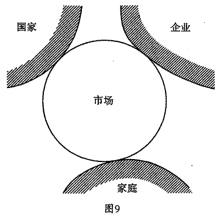

## 第十三章尾声——寻找女权主义者的另一种选择

### 国家、企业、家庭——革新的时代

即将跨入的 20 世纪 90 年代，是人、物、金钱以及信息的无国界经济（border less economy）时代。在这一时代中，柏林墙倒塌了。然而，这就意味着西柏林所代表的资本主义取得了胜利吗？

回答是否定的。资本主义再一次不得不面对时代的变动。这个时代也就是资本主义与暂时处于协调状态的资本主义“外部”的各个变量——国家、人种和家庭等达成和解的时代。而这样的变化拉开了时代的序幕。

尽管经济无所不在，不，应该说尽管经济不断蔓延，但经济与周边环境（不仅是自然环境）的关系却并非处于需要重建（restructuring）的时期。

我们先来看一下与市场有关的参与者所处的环境条件。市场中有三类参与者：国家、企业和家庭（收支），而就是它们的出现奠定了经济学的基础。实际上，在市场的参与者中，个体始终都没有出现。无论是国家还是企业，它们都如同个体一般拥有”法律人格”, 参与经济活动。个体是无法再进行分割的单位，它处于国家、企业所未能触及之处。由于家庭（收支）单位也仿佛拥有“人格”一般同样参与着经济活动，这样一来，家庭的内部仿佛是无法介入的“黑匣子”。想来，市场就是被内部结构不明的国家、企业以及家庭这片“黑暗”所笼罩的、像机械一样的、透明的游戏领域。对于国家、企业以及家庭，资本主义究竟解析出了什么呢？

_图 9_

马克思一直都知道国家是非资本主义的变量，因而他所提出的马克思主义国家论才得以存在。马克思主义国家论并不能完全等同于资本主义的理论。国民国家是市场与国家暂时达成调停的结果，它并不是一个超历史的概念。而国家垄断资本主义理论则主张国家等同于垄断资本，它试图使国家完全从属于资本主义。但随着资本总额的帝国主义式扩张，最终导致了个别资本的破灭，继而使资本主义整体出现了危机。国家不会像资本总额那样合理运转。因为国家是权力，而权力无须遵循市场规则。

正如“近代家庭”是资本主义与家庭达成历史性妥协的结果，“近代国家”也是资本主义与国家达成历史性妥协的结果。但倘若我们说，存在着马克思主义国家论却不存在马克思主义家庭论，那么就意味着马克思知道国家是人为创造之物，但他却将家庭看成“自然”之物。也就是说，谈论家庭时的禁忌远比谈论国家时的要更多。而正是女权主义，打破了这种禁忌，并揭露了家庭这种人为制度中所存在的“不自然”之处。

然而，“企业”真的属于资本主义吗？企业虽然进行着资本主义式的经济活动，但企业的内部结构却丝毫没有依照资本主义式结构建立。所以经济学与管理学的准则大相径庭，经济学主要研究企业的行为，而管理学主要研究企业组织。由于马克思主义将管理视为劳资双方的对立，所以虽然马克思主义有劳动运动论，却没有马克思主义管理论。实际上，工会这种组织已经变成了企业组织的缩影。但由于它欠缺从管理角度出发的组织论，所以出现了这种讽刺性反论，也就是说，工会组织其实比企业组织更加死板落后。

但是，在日美贸易战中，日本企业之所以能够取得“市场的胜利”，其中一个原因恐怕就是市场外部因素的“日本式管理”给市场带来了效果。在市场理论之下，组织经常被置于“黑匣子”之中。在组织中，历史、文化、习惯等非市场性因素也发挥着重要作用。虽说家庭在市场中如代理人一般从事着经济活动，但家庭内部丝毫没有被市场化。以此类推，企业虽然是资本主义最强有力的代理人，但其内部结构也丝毫没有被市场化。管理学的盛行以及近年来对网络组织论 [金子，1986；金井、金子，1988] 的关注，都体现了人们迫切要求企业人进行企业组织的流动化和企业革新的工作。. 而这也意味着帯场与企业的分界线将会被重新划定。

不仅仅只有家庭急需重新调整与市场的关系，国家、企业也试图进入与资本主义调停的新阶段。如此一来，国籍、人种、性别、年龄等经济外部的变量则又重新被赋予了巨大的意义。

女权主义引入了“性”这一视角，因此它可以尝试做横跨各个领域的总括性分析。也正因为女权主义引入了“父权制”这一性统治的概念，因此女权主义的探讨对象不只是父权制资本主义，它还可以涉及父权制式的国家以及父权制式的企业组织等相关问题。但是，从性统治这一分析视角出发，其本身也存在着局限。因为女权主义并不涉及种族主义以及年龄歧视等问题。而将女权主义称为“所有歧视”的解放理论，这其实是一种越权行为。女权主义虽然在性统治问题上进行了彻底的讨论，但却没有解明种族歧视的运作机制。正因如此，当下女权主义需要做的是，提出一种兼容国家主义、种族主义、年龄歧视等其他各种关于歧视的理论，并构筑起一套有关压迫机制的多元化理论。与其批判马克思主义女权主义将“市场和家庭的理论”二元论化，不如应该将眼光投向包含国家、人种等要素的更多元的理论。经济语言至多不过是进入近代之后的市场经济语言而已。与其试图用经济语言将一切事物进行一元化的描述，倒不如去探讨市场与市场外部问题——市场是如何被市场外部领域包围着的？而市场又是如何依存于市场外部领域的？只有这样，才能找到取代市场和资本主义的另、\_种“经济”方式。而女权主义就是为了达成这个目标所提供的一种方法。

### 批判经济学

当经济学一词从"oikos 的学科”（Oeconomia）演变为 Economy 的时候，“经济”的概念就把“生活”从“生产”中驱逐出去了。卡尔 · 波兰尼试图将“经济”的含义扩大为整个“生存”（subsistence）的含义 [波兰尼，1982]。而他所做的尝试被坐井观天、一心只热衷于市场模拟游戏的主流经济学家所忽视了。马克思主义经济学也是从“批判经济学”出发的。而当我们谈到经济时，我们就只能通过讨伐这种本末倒置的理论来批判经济学了。

在资本主义社会中，并不是为了生活而生产，而是为了生产而生活。我们首先需要确认的是：资本主义社会就是这种颠倒的社会。[渡边，1987：143]

在二战之后的日本，大熊信行从根本上颠覆了“经济”的概念，同时他也参与了家庭主妇论争。

> 目前……如果重新描绘近代家庭的因素，即便只是一种框架，我们首先应该考虑的基本事实仍然是生产行为。由于“生产”和“被生产”原本都是与生命有关的术语，所以"生产”这一词语（例如马克思、恩格斯所提出的观点、即是如此）就自然地优先被使用于家庭领域。然而，当下“生产”这一术语不幸成为被经济学独占的用语，它早已转意为物质财富的生产，并且仅仅意味着物质财富的生产。如此一来，它逐渐成为所有人使用的日常用语。并且，人们习惯性地遵循这些用语的使用方法，实际上这就意味着，人们不自觉地遵循着当下经济理论中所特有的观点。也就是说，将自我的思考寄托于企业营利之上，或是以物质财富生产为中心。当下，对于试图弄清家庭生活本质的我们而言，如果不能脱离以往的经济理论式的观点，那么我们今，后将会举步维艰。[大熊，1956; 上野，1982a 收录：114-115]

面对如此明了的经济学批判，战后的经济学家们却没有接受这样的挑战。于是大熊的尝试在日本学界始终孤立无援、无人继承。襁褓之中的“颠覆经济学”的想法尚未成形，大熊就辞世了。大熊提出，“这意味着在有关家庭以及家庭生活的问题上，需要提出一种与以往经济学不同的、另一种独立的科学”。而真正实现了大熊这种预见的，正是 30 年后登场的女权主义。

女权主义挑战的是以生产为中心的“经济”概念本身，以及对此并未提出疑问的“经济学”。女权主义与马克思主义经济学共享了“批判经济学”，但女权主义者认为马克思主义对“经济学”的批判不彻底，至少它对于家庭这一再生产领域表现出了视若无睹。这就好比一些男性对自己的男性气质产生了怀疑继而走向了女权主义，但他们却在女权主义者集会时成了无可置疑的被声讨对象，这样的矛盾与上文所述的情况类似。

20 世纪 70 年代之后，学界所有的社会科学都因迫于女权主义带来的冲击而进行自省，而这时只有经济学领域（特别是近代经济学）似乎依旧风平浪静。诚然，女性经济学家的数量的确增加了，但她们仅仅只是一心为了展示女性拥有与男性同样的定量分析能力。或者说，她们将研究目标转向了“隔离区”的女性劳动市场，并努力构建更加精细的理论模式。然而，她们都没有对经济学的准则提出根本性质疑以及挑战。这仅仅是因为经济学是高度发达的社会科学的神圣地带吗？我认为这只源于经济学家狭隘的科学主义和操作主义以及对知识的懈怠而已。

在过去的 20 年间，马克思主义女权主义不断地对经济学提出了批判，他们相继提出了“家务劳动”、“无偿劳动”、”父权制”、“再生产”等相关概念。这些概念对解决当下女性的问题是不可或缺的分析概念。至此，我们可以说，马克思主义女权主义拥有了一定的解析能力，并做出了对理论进行补充的贡献 [*] 。

> [*] 这种理论贡献无论再怎么强调都不为过。“家务劳动”这个概念发现了”家务”是一种"劳动”。在这个概念出现之前，"家务”并不是"劳动”。

不仅如此，马克思主义女权主义者成功地对马克思主义的概念进行了修改和扩大。这些概念越是适用于“对性视而不见”的领域，外界对这个概念机制的不满就也愈发强烈。换言之，当我们将“女人所从事的活动”表述为“（家务）劳动”以及“（再）生产”概念的时候，我们忽略了什么呢？

如果用马克思的术语来描述，以往的马克思主义女权主义者所从事的工作就是“女人所从事的活动”。但是，马克思理论是有关市场和经济的理论。马克思理论的广泛应用就是将“劳动”、"生产”这些经济术语用于“女人所从事的活动”之中。

即便马克思主义将“女人所从事的活动”称为“再生产”而非“生产”活动，但是马克思主义将社会视为"生产和再生产单位”的生产至上见解依旧没有任何改变。倒不如说，马克思主义将性和生殖定义为”再生产”, 是将其仅仅看作是一种合乎近代功利主义目的的活动。从这两点上来看，这种观点符合了人们的性规范 [*1] 。另外，女权主义者将“家务”定义为“劳动”（无论“家务”是有使用价值的生产还是有交换价值的生产）, 即便我们暂且不谈这种分析概念对女权主义者意识的形成所做出的巨大贡献，单单将“劳动”这一概念所拥有的各种属性都纳入分析领域，这种做法的贡献就不容小觑。与此相似的是，近代人逐渐把自己的各种活动当作是劳动，这种看法也同样影响了女性的领域。但“家务劳动”论没有看到家务中所包含的“性”（Erbs）这一特征，而这就是小浜逸郎提出批判的依据之所在 [小浜，1986] [*2] 。

> [*1] 人口学将生殖看作是"人口资源”的"生产”。这种观点是在近代形成期出现的。而将性看作是为生殖目的服务的一种生产至上主义的性爱观，这也是近代所特有的。

> [*2] 小浜的女权主义批评在一定程度上是合理的。但另一方面我们更要认识到，强调家务中所包含的"性的特征”，其实也是一种近代主义幻想对"家务”的投影。

### 对“劳动”概念的再探讨

我们将“女人所从事的活动”用“劳动”和“生产”的概念来表述，如此一来，我们接下来的任务就是通过从根本上重新审视“劳动”以及“生产”的概念来进行理论的“颠覆”。对马克思主义者而言，近年来就“劳动”概念的重新审视意义非凡。

鹫田小弥太在题为《论“人类的本质是非劳动”的相关准备性考察》 [鹫田，1987] 这一篇极富挑衅性的文章中提出，“应该将马克思主义中‘生产至上主义’的趋势重新定义为‘劳动至上主义’” [同上：106] , 并建议重新审视“人类的本质是劳动”这一马克思主义基本原理。

> 提议 1: 暂且先舍弃从历史连续一贯的角度去思考这一问题。
> 提议 2：该问题首先应该从近代资产阶级（市民）社会所固有的理想理念的角度来考察。
> 提议 3：将这一问题从解放劳动者的原理出发去理解，使之成为建构社会主义、共产主义思想的一个重要条件。[同上：103]

马克思理论认为，人类是由“劳动”来定义的。从“劳动”的概念看，正如鹫田所指出的一样，孩子是劳动力形成过程中的“不完全的人”，而老人则是“无用之人”。接下来这点虽然他并没有提及，但如果再加上女人的话，那么女人就自然是二流的“劣等”劳动力了 [*] 。

> [*] 在本书的第一章中，我已经论述了如果成年男性是近代"个人”概念的标准，那么孩子必然就是”人之前”, 老人是”人之后”, 而女性则是"人之外”的存在。

“劳动”的概念将人的活动分成了“劳动”和“非劳动”。而非劳动只不过是为了将“劳动的剩余变为劳动所作准备”的“休闲（再创造）”[同上：105]。

当下，休闲时间逐渐增加，可以说社会在不断“休闲社会”（leisure society）化。在这样的背景下，马克思主义者提出了对“劳动”概念进行再讨论的课题任务。但我们先不说鹫田的观点，这里所提出的“休闲”不过是作为劳动的剩余和补充物的非劳动而已。

马克思主义中有关休闲社会论的先驱之作应该是保尔 · 拉法格（Paul Lafargue）的《懒惰权》（1880）。拉法格是马克思的女婿，他是马克思的二女儿劳拉的丈夫。这篇副标题为《驳斥
1848 年“劳动权”》的论文早在 19 世纪便由马克思的女婿撰写而成。由此可见，这暗示了马克思主义从一开始就在重新审视“劳动”的概念了。

井上俊在介绍拉法格的一片短评中指出，极端地来说，“’懒惰权，就是'休闲的权利’”，他认为拉法格的理论是前沿的休闲理论，“这种看法即便在现代也是有效的”。另外，他还这样补充道：

> 然而，虽然这样的见解并无问题，但却存在着某种局限性。拉法格不仅仅是被其语言上的挑战性所吸引，他难道不是将"休闲”所无法完全承载的含义用“懒惰”这一词来表现吗？ [井上，1973：144]

井上认为，对拉法格而言，“'懒惰'意味着对'劳动’长子——'进步'之神”的逆反，这是“自由”的主张 [同上]。对拉法格而言，他所面临的并非是通过“劳动”向“非劳动”的转变而超越、解决的问题，也不是将“劳动”变为主体性、自发性的“自由劳动”的问题，更不是从“劳动”中逃向“非劳动”的问题，而是“劳动”与“非劳动”这种划分方法本身存在着问题。他那伟大岳父的思想反映了工业社会形成时期的禁欲式生产伦理，然而，他对此所提出的异议也只能用“懒惰”这一充满诙谐的、挑衅的方式来表现罢了。并且，作为马克思一族的浪子，他的声音在马克思主义流派里很，快就销声匿迹了。

### “自由劳动”与“脱离劳动的自由”

马克思将“劳动”神圣化是因为他沿袭了他所经历的那个时代的思想。那是一场资产阶级对劳动观进行的革命。在那之前，在犹太教—基督教的传统中，“劳动”（labor）这一概念一直是带有消极意义的，它指的是人类被逐出乐园时所要背负的苦难。因此，长久以来“劳动”被认为是牛马、奴隶等做的事，而不是贵族的事。贵族应该在神学、哲学（既意味着“休闲”又意味着“学问”）上消磨时间。
若想逆转这种看法，把被视为卑贱之事的劳动赞美为符合绅士贵族的行为，势必要对劳动观进行革命，而资产阶级就做到了。资产阶级就是要把这种“为了资本的劳动”，也就是被错当作一种崇拜一般的异化劳动，当作是有价值的行为加以赞赏，而他们的做法不过只是一种诡辩罢了。因此，马克思对“劳动”的批判，就是揭穿这一诡辩，就是对“异化劳动”的批判。

马克思试图从异化手中夺回劳动，恢复真正"自由的劳动”。然而，所谓“真正自由的劳动”究竟是什么呢？倘若“没有被异化的劳动”的“本质”、“根本性”不是意识形态构建之物，那它又是什么呢？这种“自由劳动”的意识形态，“与其说是在资本家社会，不如说是在劳动者社会”中，以“荒诞”的形式得以实现 [鹫田，1987：105] 。鹫田曾指出，奥斯维辛集中营的入口处所挂着的“劳动使人自由”的标语，这极具讽刺意味。

他提出由“脱离劳动的自由”来代替“自由劳动”，并且针对“人类的本质是劳动”这一命题，他颠覆以往的观点，提出了“人类的本质是非劳动”。然而，在“劳动”与“非劳动”之间出现的这种反复摇摆，只会使得讨论再次走入死胡同。我们需要的并非是“脱离劳动的解放”, 而是“脱离’劳动'这一概念的解放”。并且我们需要重新审视把人类活动（activity）划分为“劳动”和“非劳动”的这种观点。

从“非劳动”的角度将“劳动”相对化，这种反复摇摆的做法使我想起了女权主义者们。他们对“家务劳动”这一概念在正面评价和负面评价的两极之间不断变换。只要将再生产劳动定义为父权制下的、无偿的劳动，那么“家务劳动”对女性而言便是极度的异化劳动。这种拒绝劳动异化的方式，正如达拉 · 科斯塔所说，看上去只不过是一种女性“拒绝家务劳动”的战略式罢工而已。

另一方面，总有这样的观点反复出现，即相对于生产劳动而言，家务劳动是非生产劳动。从资本主义中的“劳动”来看，正因为家务劳动是“非劳动”，才使得家务劳动在“相对意义上没有被异化” [Vogel,1973；Donovan,1985 收录：日译本 120 页] 。家务劳动是生产使用价值的劳动。与生产交换价值的劳动相比，它“相对而言是没有被异化的”。所以，承担家务劳动的家庭主妇从事“没有被异化的生产活动，她们所进行的活动更接近于生产” [同上] 。

> 正是这种未被异化的劳动经验，给主妇们批评异化劳动问题提供了攻击点。..... [Donovan,1985：日译本 120 页]

对家务劳动的两极评价，影响着对作为家务劳动者的“家庭主妇”是否具有“革命性”的判别，两者息息相关。家庭主妇应当被看作是“最为落后的”、“最被异化”的人，还是“最为解放的”、“最为自由的”人呢？对于她们的评价在这两种观点之间反反复复、摇摆不定。如果让我来回答的话，我认为，上述两极分化的观点不过是用相同理论所组成的盾牌的两面而已。

要想反驳十分简单。第一，家务劳动只要也是劳动，它就不可能是“非劳动”。第二，就所谓“生产使用价值”的这种说法而言，在资本主义的语境下只不过意味着家务劳动“不生产交换价值”而已。第三，处于父权制资本主义下的家务劳动不可能脱离生产劳动而实现一个人的”自由”。许多学者都十分欣赏以下这种看法，即“只有家庭或是私领域才能提供资本主义工业社会中唯一不被异化的空间”。但反言之，所谓的“避难港湾”对女性和孩子而言，瞬间就可以摇身变为“压迫和暴力的专制王国”。如果生产劳动会被异化，那么家务劳动也同样也会被异化；相反，如果家务劳动带有喜悦和自我实现的意义，那么生产劳动应该也有。

生产劳动与家务劳动，无论将哪一方特权化都是错的。劳动划分本身，以及使“劳动”和“非劳动”这种划分成为可能的“劳动”这一概念才是问题之所在。

### "劳动”的颠倒

安永寿延在题为《“劳动”的终结》这部颇有争议的著作中提出的以下观点耐人寻味。亚当和夏娃的神话告诉了我们：人类背负着原罪，以及人类为了偿还原罪而要进行劳动一苦役的起源。书中写道：

> 人类……在被诅咒的“劳动”和“分娩”之中，不断进行着生命的生产与再生产。如此一来，“劳动”和“分娩”就不仅仅是平行的两件事了，甚至可以说“劳动”的原型就是"分娩”。因此，男人们每天不得不经受着阵痛。他们虽然免于分娩的痛苦，但不得不每日生产"生命之粮” [*]。[安永，1985：8]

> [*] 原文附加了 ピオス 一词，这里指希腊语的 Buós; 英语为 bios, 意为生命。——译者注

经过马克思主义女权主义者的不懈努力，他们通过把分娩称为“再生产”, 使分娩能用“生产”这一用语来表述。但是安永则认为，“生产”的原型就是“分娩”的隐喻。倘若如此，那么马克思主义女权主义者所论述的生产与再生产的关系就犯了颠倒黑白的大错。即便如此，正是在这“颠倒”的论述中，蕴含着马克思主义女权主义解析“近代”的秘密。将“再生产”表述为“生产”的这种颠倒内在逻辑的表述方式并非马克思主义女权主义者所犯下的错误。而正如马克思主义理论历史性地体现了它所分析的工业社会中的生产至上主义那样，这种近代父权制资本主义所犯下的颠倒黑白的错误，也在这种理论中有所体现。

> “劳动——分娩”，即希腊人所说的珀诺斯（辛苦）……诚然，珀诺斯这一希腊文的原义就是直接地指代生育之苦，并且意为养育孩子的劳神费心。 [同上：8, 强调部分为原作者所加]

他从词源学上对“劳动”一词的考察并非只是故弄玄虚。他认为，“劳动——关怀”向“关怀——劳动”这一转化过程的颠倒变化，正是“从中世纪到近代的过渡”。

> 以前，“劳动一分娩”绝不是"以贪图方便为目的的、为迎合某种事情所做的劳动”（霍布斯语）。如今，自然变成像人类的孩童一样的、"顺从”的存在。自然成为人类的随从〔subject）, 人类相对于自然一客体而言，是主体（subject）的存在。劳动正是规定「自然与人类关系的、极为历史性的概念。 [同上：9, 强调处为原作者所加，括号内为引用者所加]

所以，马克思认为劳动概念这一表述自古以来就有。对此安永则提出，“发现劳动的近代人把劳动当作超历史概念，并将其普遍化”，而这恐怕才是问题的“最大元凶” [同上：28]。

当劳动力开始转变为商品，当劳动成为为了资本而存在之物的时候，“劳动”概念便产生了颠倒。当生产被置于崇拜的错觉之下时，包括再生产之内的一切都不可能逃脱这种颠倒。倒不如说，在“家庭性”（domesticity）这一领域中，一旦把“女人所从事的活动”用“再生产”这一术语来表述，就能明确再生产究竟从属于（subject）什么了。如此一来，一切颠倒便开始了。在父权制资本主义之下，只有一人户 [*] 才能逃离压迫，一人户的家庭宛如是自由的“避难港湾”，这种说法是毫无道理的。“家庭性”亦是如此，它使女人处于从属地位，将孩子视为“人的资源”。而这种想法更是一种严重的颠倒和倒退。“再生产论”不正是解析了这种颠倒是基于何种机制而形成的，以及明确了这种倒退的最终走向吗？

> [*] 指一个家庭只有一个人。——译者注

我们无法通过“生产论”来突破“生产”的难关，也无法通过“再生产论”来突破“再生产”的难关。安永与拉法格都试图将“从劳动中解放出来”当作处方良药。然而，如果这意味着从“劳动”向“非劳动”的解放，那么我们只会再次陷入同样的两极分化和循环往复的陷阱中。真正的问题在于从“劳动”这一概念中解放出来。与此同时，我们还要提出革新人类行为的新方法。

然而，即便如此，假如把我提出的观点看作如同意识变革一样的观念论的话，也着实让人苦恼。"劳动"这一概念是被嵌入（embeded）在一定历史社会体制（asset）之中的。我们如果想要改变某一概念，就要改变其存在的体制和语境。倘若如此，在重新审视“劳动”概念时，女权主义者式的观点又是怎样的呢？

女权主义必须要做的是去质疑表述女性经验的概念是否恰当，并去改变产生这种概念的基础。这样一来，只有当我们使用这些概念并试图淋漓尽致地表述女性经验时，这些概念的局限性才会显现出来。

比如说，育儿真的可以称作是“再生产劳动”吗？它是为了“再生产”某种事物而进行的“劳动”吗？将育儿称为“再生产劳动”，对于表述资本主义父权制之下的女性经验，在某种程度上来说是恰当的。这是因为父权制资本主义规定了女性的社会分工。所以，质疑并试图重新创造“再生产劳动”这一概念，不仅仅意味着改变理论的框架，它还意味着质疑和改变父权制资本主义强压给女性的角色。

同样，如果把女性进入了“劳动”市场这一行为，仅仅看作是她们同男性一样被置于“劳动”异化之下的活动，那么这样的看法就只是多此一举了。女性参与“劳动”不可避免地应该要求改变“劳动”的意义。相反，如果男性参与“再生产”，倘若仅仅是同现在的母亲们一样，处于同样的生产/再生产分工下，只会导致男性成为母亲而已。也就是说，孩子不再只有一位母亲了，他拥有两位母亲。如果这仅仅只是角色的交换，男性参与育儿劳动，这种改变本身就是毫无意义的。如果仅仅以功利性目的及手段出发，对处在性统治与世代间统治的”再生产”进行改革，而不对其进行质的改变（若改革达成，育儿就不能再称作是“再生产”了吧），就无法撼动父权制的地位。马克思主义女权主义尽可能地用父权制资本主义的术语来表述女性的经验，他们所做出的努力只是证明了这些术语不过是应该被废弃的对象而已。

### 女权主义者的另一种选择

> 究竟在怎样的条件下，女性才会接受自己所处的状况不是“自然”的且不是“命运的定数”这种观点、呢？我认为，这关键在于生产过程之中发生的变化。当社会性别（gender）机制与劳动性分工陷入矛盾对立关系时，当两者之间不再存在和谐时，这种观点、才会被女性接受。二者无法兼顾的事实给（女性的）斗争和疑问提供了潜在的可能性，而这也是两性之间对立和冲突的原因。然而我们无法提前“看透”这种斗争的方向。[Edlholmetal.,1977：126]

正如埃德霍姆（FelicityEdholm）所说，在父权制与资本主义互相矛盾和冲突的时候，对女性而言的另一种选择才会逐渐变为现实。资本主义与父权制一直处于“冲突与紧张”的关系中。.“二战后，延续至今的已婚女性所从事的非全日制劳动，也是在围绕争夺女性劳动的问题上，资本主义与父权制相互妥协的结果。”[Walby,1986：247]

在题为《回顾女权主义的二十年》的这篇回忆式的随笔中，米切尔这样谈道：

> 回顾女权主义过去 300 年的历史，从开始到高潮，在其断断续续的发展之中，它兴起的时期或许与特定社会经济变动期并不一致。在其发展过程中，只有当女性重新进入生产时，抑或是她们的进入重新被认可时，她们才能暂时性地占据了先驱的地位。[Mitchel,1986：48]

米切尔所说的女性在变革之中所处的先驱地位是指：

> 这不仅只意味着社会全体的汝性化（feminized）或者雌雄同体化（androgynized）, 当然，这也是改变的其中一个原因。更是因为女性处于社会的边缘地位，因而她们更容易受到变革的影响。[同上：47]

我们当下正处于社会发展的急速巨变期。在这个巨变期之中，资本主。义和父权制共同面临着革新的危机。丝黛西（JudithStacey）谈道，“女权主义者对近代核心家族的批判，正出现于家族体制穷途末路的衰退时期"[Stacey,inMitchel&Oakleyeds.,1986：237],

> 这丝毫不是什么悖论。所谓有效的批判是不可或缺的、能够代替现状的蓝图，并且这一蓝图在变化过程中是一目了然的。[同上：237]

丝黛西指出，在某种意义上，女权主义已经在批判危在旦夕的体制了，但他们的批判对历史的推程只起到了加速的作用。

米切尔这样谈到有关生产领域中女性的参与问题：

> 在这种急速的巨变期之中，通常而言，似乎中老年女性更趋向于进入新的工种。无论是中产阶级的女性还是劳动者阶级的女性，她们都从事着新兴的工作。在我看来这里出现了一种可能，即无论男女，他们未来从事的工作都属于劳动者阶级般的工作。倘若如此，那么男性恐怕会洽落为失业者。 [Mitchel,1986：41]

米切尔预言，在“男性失业者”与“从事新兴工作的中产阶级女性”中，也许会出现新型的“自营业者”（self-employed）或“企业家”（
entrepreneur）。20 世纪 90 年代的日本就惊人地印证了她的预言。

与丝黛西一样，米切尔也曾讽刺地自问自答道：女权主义加快了这一过程，“对资本主义已经开始发生的变化，女权主义不过是起了一种推波助澜的作用吧？” [同上：47] 然而，

> 我们的展望没有任何过错。只不过是反映出了历史进程中的变化而已。 [同上：48] [*]

> [*] 有关 20 世纪 80 年代英国和日本女性（和女权主义）所面临的资本主义变化的真实写照，请参照 Ueno（1989）。

这种变革的意识形态与历史之间的关系，正如同马克思主义理论的发展。马克思主义实践也会参与并推进“正在进行的历史变化”，继而落下帷幕。但这并不意味着这些运动可有可无。

丝黛西指出，“这些变化所带来的改变对大多数女性而言不一定是积极的结果" [Stacey,in Mitchel&Oakleyeds.,1986：238]。这不可避免地导致了在变化之中得利的女性与被淘汰的女性这两者之间的分裂。并不是所有女性都处于“变化先驱”的地位。米切尔认为，反而是处于最边缘地带的女性占据了先驱的地位，她的这种看法产生于女性向“新阶级（革新）的发展期，这是新阶级革新尚未完全确立的时期”。

在这一过程之中，男人与女人、男性气质与女性气质这种界限已被混为一谈，需要重新定义。米切尔说，这时不仅出现了“新男性”（newmen）, 在这种性差的重新定义中还出现了拥有新价值的当代“女性” [同上] 。

> 女权主义并没有以现有的姿态改变男性和女性或者男女双方。女权主义试图改变男女之间的关系。 [Barrett,1980：254, 强调处为引用者所加]

女权主义者在经历了一系列尝试（这种尝试也就是把女性的经验用男性的概念痛快淋漓地表述）之后，他们才第一次收获了男性字典中所没有的概念，并对这些概念给予了新的评估。在这些常识中，我将引用海迪 · 哈特曼，一位最果敢的马克思主义女权主义学者的“发现”:

> 资本主义下的性分工使得女性学习到了一种经验，即究竟什么才是人类的互相依存和需要呢？长期以来，男性都在与资本对抗和斗争，而女性明白了自己要为追求什么而斗争。就一般常识而言，父权制与资本主义中男性的地位会阻止人们认知相互关怀、互相分享、成长等这些人与人之间的需求。而这种需求在没有差异化的关系中，在非父权制社会中是可以实现的，但这种实现的能力也会被男性剥夺占有……我们要构建的社会，是把相互依存看作解放而不是看作耻辱的社会 [Hartman,1981:33, 强调处为原作者所加] [*] 。

> [*] 女权主义的成熟，就是从"依存"（dependence）到"自立"（independence）再到达"相互依存”（inter-dependence）的过程。我们并不赞同以往那种"孤立”、"拒绝帮助”等狭义的"自立”概念。而这也是对"近代个人主义”的质疑。

我们并不是将“女性的经验用男性的语言来表述”，而是当“男性所做之事可以用女性的语言使其相对化”这种行为成为可能之时，只有这时，马克思主义女权主义的局限之处，准确来说，处于资本主义与父权制中的女性经验，才第一次能够脱离资本主义与父权制的语境，并找到另一种选择吧！
